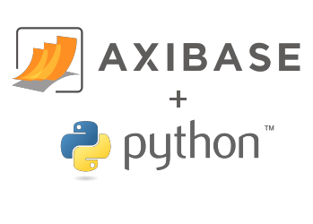

# ATSD Python Client



## Table of Contents

* [Overview](#overview)
* [External References](#external-references)
* [Requirements](#requirements)
* [Installation](#installation)
* [Upgrade](#upgrade)
* [Connection Test](#connection-test)
* [Connecting to ATSD](#connecting-to-atsd)
* [Debug](#debug)
* [Services](#services)
* [Models](#models)
* [Inserting Data](#inserting-data)
* [Querying Data](#querying-data)
* [Analyzing Data](#analyzing-data)
* [Examples](#examples)

## Overview

**ATSD Python Client** enables Python developers to read statistics and metadata from [Axibase Time Series Database](https://axibase.com/docs/atsd/) as well as build reporting, analytics, and alerting solutions. **ATSD Python Client** supports various request methods, for interfacing with the database, such as SQL or REST API endpoints.

## External References

* [ATSD REST API Documentation](https://axibase.com/docs/atsd/api/data/)
* [ATSD SQL Documentation](https://axibase.com/docs/atsd/sql/)
* [`atsd_client`](https://pypi.python.org/pypi/atsd_client) on PyPI.
* [`atsd_client` Documentation](http://pythonhosted.org/atsd_client) on `pythonhosted.org`.

## Requirements

Check Python version.

```bash
python3 -V
```

The ATSD client supports Python &ge; `3.5.0`.

> If necessary, install `pip3` (`pip` for Python `3`) with `apt-get install python-pip3` on Ubuntu.

## Installation

### Installing Module with `pip3`

Install the latest `atsd_client` module with [`pip3`](https://pip.pypa.io/en/stable/).

```bash
pip3 install atsd_client
```

Upgrade setup tools with `pip3 install --upgrade setuptools`.

### Other Versions

Include a version number in the `pip3 install` command to install a specific version number other than the latest.

```bash
pip3 install atsd_client==2.3.0
```

> Use this command to downgrade the module as well.

### Module Version

Check `atsd_client` module version.

```bash
pip3 show atsd-client
```

```txt
Name: atsd-client
Version: 3.0.0
Summary: Axibase Time Series Database API Client for Python
Home-page: https://github.com/axibase/atsd-api-python
Author: Axibase Corporation
Author-email: support-atsd@axibase.com
License: Apache 2.0
Location: /usr/local/lib/python3.5/dist-packages
Requires: tzlocal, requests, python-dateutil
Required-by:
```

To install the client on a system without Internet access, follow the [Offline Installation Instructions](offline_installation.md).

### Installing from Source

Clone the repository and run installation manually.

```bash
git clone https://github.com/axibase/atsd-api-python.git
cd atsd-api-python
python3 setup.py install
```

### Verify Installation

Confirm all required modules are installed.

```bash
python3 -c "import tzlocal, requests, dateutil, atsd_client"
```

**Empty** output indicates successful installation. Otherwise, the output displays an error which enumerates missing modules.

```python
Traceback (most recent call last):
  File "<string>", line 1, in <module>
ImportError: No module named atsd_client
```

## Upgrade

Execute `pip3 install` to upgrade client to the latest version.

```bash
pip3 install atsd_client --upgrade
```

Execute `pip3 list` to view currently installed modules.

```bash
pip3 list
```

```txt
Package             Version
------------------- ------------------
asn1crypto          0.24.0
atsd-client         3.0.0
certifi             2018.4.16
cffi                1.11.5
...
```

## Connection Test

Create `connect_url_check.py` which contains a basic connection test.

```python
from atsd_client import connect_url

# Update connection properties and user credentials
connection = connect_url('https://atsd_hostname:8443', 'john.doe', 'password')

# Retrieve JSON from '/api/v1/version' endpoint
# https://axibase.com/docs/atsd/api/meta/misc/version.html
response = connection.get('v1/version')
build_info = response['buildInfo']
print('Revision: %s ' % build_info['revisionNumber'])
```

Navigate to the directory of the `connect_url_check.py` file and execute the test.

```bash
cd ./path/to/connect_url_check.py
```

```bash
python3 connect_url_check.py
```

Console indicates successful connection:

```txt
INFO:root:Connecting to ATSD at https://atsd_hostname:8443 as john.doe user.
Revision: 19###
```

## Connecting to ATSD

To connect to an ATSD instance, **hostname** and **port** information is required. By default, ATSD listens for connection requests on port `8443`.

> Create a user account on the [**Settings > Users**](https://axibase.com/docs/atsd/administration/user-authorization.html) page, if needed.

Establish a connection with the `connect_url` method.

```python
from atsd_client import connect_url
connection = connect_url('https://atsd_hostname:8443', 'john.doe', 'password')
```

Alternatively, create a `connection.properties` file.

```txt
base_url=https://atsd_hostname:8443
username=john.doe
password=password
ssl_verify=False
```

Launch Python and specify the path to the file `connection.properties` in the `connect` method.

```python
from atsd_client import connect
connection = connect('/path/to/connection.properties')
```

## Debug

Specify the `DEBUG` argument **before** `import atsd_client` to include logs in console output:

```python
import logging
logging.basicConfig(level=logging.DEBUG)
import atsd_client
```

```python
DEBUG:root:Checking 'python-requests' version...
DEBUG:root:Module 'python-requests' version is 2.19.1. The version is compatible.
DEBUG:root:Connecting to ATSD at https://localhost:8443 as axibase user.
DEBUG:urllib3.connectionpool:Starting new HTTPS connection (1): localhost:8443
DEBUG:urllib3.connectionpool:https://localhost:8443 "GET /api/v1/entities?tags=%2A&expression=createdDate+%3E+%272018-05-16T00%3A00%3A00Z%27 HTTP/1.1" 200 None
```

## Services

The client supports services to insert and query particular types of records in the database. These include `Series`, `Property`, and `Message` records as well as metadata records such as `Entity`, `Metric`, and `EntityGroup`.

```python
from atsd_client.services import *
svc = SeriesService(conn)
```

Available services:

* [`SeriesService`](./atsd_client/services.py#L44)
* [`PropertiesService`](./atsd_client/services.py#L95)
* [`MessageService`](./atsd_client/services.py#L192)
* [`AlertsService`](./atsd_client/services.py#L153)
* [`MetricsService`](./atsd_client/services.py#L235)
* [`EntitiesService`](./atsd_client/services.py#L340)
* [`EntityGroupsService`](./atsd_client/services.py#L469)
* [`SQLService`](./atsd_client/services.py#L619)
* [`CommandsService`](./atsd_client/services.py#L661)
* [`PortalsService`](./atsd_client/services.py#L679)

## Models

Use the service to insert and query particular types of records in the database, which are implemented as Python classes.

* [`Series`](./atsd_client/models/_data_models.py#L133)
* [`Sample`](./atsd_client/models/_data_models.py#L47)
* [`Property`](./atsd_client/models/_data_models.py#L360)
* [`Message`](./atsd_client/models/_data_models.py#L778)
* [`Alert`](./atsd_client/models/_data_models.py#L436)
* [`AlertHistory`](./atsd_client/models/_data_models.py#L593)
* [`Metric`](./atsd_client/models/_meta_models.py#L53)
* [`Entity`](./atsd_client/models/_meta_models.py#L295)
* [`EntityGroup`](./atsd_client/models/_meta_models.py#L396)

## Inserting Data

### Inserting Series

Initialize a `Series` object and populate the object with timestamped values.

```python
from atsd_client.models import Series, Sample

series = Series(entity='sensor123', metric='temperature')
series.add_samples(
    Sample(value=1, time="2018-05-18T17:14:30Z"),
    Sample(value=2, time="2018-05-18T17:16:30Z")
)
svc.insert(series)
```

### Inserting Properties

Initialize a `Property` object.

```python
from atsd_client.models import Property

property = Property(type='disk', entity='nurswgvml007',
                    key={"mount_point": "sda1"},
                    tags={"fs_type": "ext4"})

svc = PropertiesService(conn)
svc.insert(property)
```

### Inserting Messages

Initialize a `Message` object.

```python
from atsd_client.models import Message

message = Message(entity='nurswgvml007', type="application", source="atsd", severity="MAJOR",
                  tags={"path": "/", "name": "sda"},
                  message="connect_to localhost port 8881 failed.")

svc = MessageService(conn)
svc.insert(message)
```

## Querying Data

### Querying Series

To query database series, pass the following filters to the `SeriesService`:

* [`SeriesFilter`](./atsd_client/models/_data_queries.py#L267): **Required**. Defines metric name. Alternatively, include data type, series tags, and other parameters.
* [`EntityFilter`](./atsd_client/models/_data_queries.py#L126): **Optional**. Accepts a single `entity` name, an array of multiple `entity` names, an `entity group` name, or an expression to filter entities.
* [`DateFilter`](./atsd_client/models/_data_queries.py#L162): Specifies `startDate`, `endDate`, and `interval`. Provide either `startDate` and `endDate` fields **or** either `startDate` or `endDate` and `interval` **or** only `interval` to define period. If only `interval` is defined, current time is set as `endtime`. Provide `startDate` and `endDate` fields as [calendar syntax](https://axibase.com/docs/atsd/shared/calendar.html) keywords, an ISO 8601 formatted string, Unix milliseconds, or a Python `datetime` object.

```python
from atsd_client.models import *

sf = SeriesFilter(metric="temperature")
ef = EntityFilter(entity="sensor123")
df = DateFilter(start_date="2018-02-22T13:37:00Z", end_date=datetime.now())
query_data = SeriesQuery(series_filter=sf, entity_filter=ef, date_filter=df)
svc = SeriesService(conn)
result = svc.query(query_data)

# Print first Series object
print(result[0])
```

```txt
2018-07-18T17:14:30+00:00             1
2018-07-18T17:16:30+00:00             2
metric: temperature
entity: sensor123
tags: tz=local
```

Optional filters:

* [`VersioningFilter`](./atsd_client/models/_data_queries.py#L309)
* [`TransformationFilter`](./atsd_client/models/_data_queries.py#L365)
* [`ForecastFilter`](./atsd_client/models/_data_queries.py#L299)
* [`ControlFilter`](./atsd_client/models/_data_queries.py#L320)
* [`ValueFilter`](./atsd_client/models/_data_queries.py#L369)

> Refer to [API Documentation](https://axibase.com/docs/atsd/api/data/series/query.html) for additional details.

### Querying Data with SQL

To perform SQL queries, use the `query` method implemented in [`SQLService`](./atsd_client/services.py#L577).
The returned table is an instance of the `DataFrame` class.

```python
from atsd_client import connect_url
from atsd_client.services import SQLService

conn = connect_url('https://atsd_hostname:8443', 'user', 'passwd')

# Single-line SQL query
# query = 'SELECT datetime, time, entity, value FROM jvm_memory_free LIMIT 3';

# Multi-line SQL query, enclose in triple quotes (single or double)
query = """
SELECT datetime, time, entity, value
  FROM "jvm_memory_free"
ORDER BY datetime DESC
  LIMIT 3
"""

svc = SQLService(conn)
df = svc.query(query)

print(df)
```

```txt
                   datetime           time entity      value
0  2018-05-17T12:36:36.971Z  1526560596971   atsd  795763936
1  2018-05-17T12:36:21.970Z  1526560581970   atsd  833124808
2  2018-05-17T12:36:06.973Z  1526560566973   atsd  785932984
```

Pandas options used by `atsd_client`:

```txt
'display.expand_frame_repr' = False
```

### Querying Properties

To retrieve property records from the database, specify the property `type` name and pass the following filters to the `PropertiesService`:

* [`EntityFilter`](./atsd_client/models/_data_queries.py#L126): Accepts a single `entity` name, an array of multiple `entity` names, an `entity group` name, or an expression to filter entities.
* [`DateFilter`](./atsd_client/models/_data_queries.py#L162): Specifies `startDate`, `endDate`, and `interval` fields. Provide either `startDate` and `endDate` fields **or** either `startDate` or `endDate` and `interval` **or** only `interval` to define period. If only `interval` is defined, current time is set as `endtime`. Provide `startDate` and `endDate` fields as [calendar syntax](https://axibase.com/docs/atsd/shared/calendar.html) keywords, an ISO 8601 formatted string, Unix milliseconds, or a Python `datetime` object.

```python
from atsd_client.models import *

ef = EntityFilter(entity="nurswgvml007")
df = DateFilter(start_date="today", end_date="now")
query = PropertiesQuery(type="disk", entity_filter=ef, date_filter=df)
svc = PropertiesService(conn)
result = svc.query(query)

# Print first Property object
print(result[0])
```

```txt
type: disk
entity: nurswgvml007
key: command=com.axibase.tsd.Server
tags: fs_type=ext4
date: 2018-05-21 14:46:42.728000+00:00
```

Optionally use additional property filter fields in [`PropertiesQuery`](./atsd_client/models/_data_queries.py#L588), for example, `key` and `key_tag_expression`.

> Refer to [API Documentation](https://axibase.com/docs/atsd/api/data/properties/query.html) for additional details.

### Querying Messages

To query messages, initialize a `MessageQuery` object and pass it to the `MessageService` with the following filters:

* [`EntityFilter`](./atsd_client/models/_data_queries.py#L126): Accepts a single `entity` name, an array of multiple `entity` names, an `entity group` name, or an expression to filter entities.
* [`DateFilter`](atsd_client/models/_data_queries.py#L162): Specifies `startDate`, `endDate`, and `interval` fields. Provide either `startDate` and `endDate` fields **or** either `startDate` or `endDate` and `interval` **or** only `interval` to define period. If only `interval` is defined, current time is set as `endtime`. Provide `startDate` and `endDate` fields as [calendar syntax](https://axibase.com/docs/atsd/shared/calendar.html) keywords, an ISO 8601 formatted string, Unix milliseconds, or a Python `datetime` object.
* Additional [filter](./atsd_client/models/_data_queries.py#L743) fields: `type`, `source`, `severity`, and `tags`. To select records with a non-empty value for the given tag, set the filter value to `*` wildcard.

```python
from atsd_client.models import *

ef = EntityFilter(entity="nurswgvml007")
df = DateFilter(start_date="today", end_date="now")
query = MessageQuery(entity_filter=ef, date_filter=df, type="application", tags={"syslog": "*"}, limit=1000)
svc = MessageService(conn)
messages = svc.query(query)

print("received messages: ", len(messages))

for msg in messages:
  print(msg)
```

```txt
entity: nurswgvml007
type: application
source: atsd
date: 2018-05-21 15:42:04.452000+00:00
severity: MAJOR
tags: syslog=ssh
message: connect_to localhost port 8881 failed.
persist: True
```

> Refer to [API Documentation](https://axibase.com/docs/atsd/api/data/messages/query.html) for additional details.

### Querying Portal

To [export](https://axibase.com/docs/atsd/api/meta/misc/portal.html) a portal use the `get_portal()` method declared in `PortalsService`:

```python
ps = PortalsService(connection)
ps.get_portal(id=192, entity="atsd", width=1000, heigth=700, portal_file="192.png", theme="default")
```

Pass additional parameters to the target portal as `key=value` pairs:

```python
# Pass tag value (it can be accessed as ${fs_type})
ps.get_portal(name="ActiveMQ", entity="atsd", fs_type="ext4")
```

By default `portal_file` is set to `{portal_name}_{entity_name}_{yyyymmdd}.png`, for example `ATSD_nurswghbs001_20181012.png`.

## Analyzing Data

### Convert to `pandas`

Install the [`pandas`](http://pandas.pydata.org/) module for advanced data manipulation and analysis.

```bash
pip3 install pandas
```

Use Pandas [`set_option`](https://pandas.pydata.org/pandas-docs/stable/generated/pandas.set_option.html#pandas.set_option) to format output:

```python
import pandas as pd

pd.set_option('display.max_columns', None)
pd.set_option('display.width', 2000)
pd.set_option('max_rows', None)
pd.set_option('max_columns', None)
pd.set_option('max_colwidth', -1)
pd.set_option('display.expand_frame_repr', False)
```

#### Series

Access the `Series` object in Pandas with the built-in `to_pandas_series()` and `from_pandas_series()` methods.

```python
ts = series.to_pandas_series()

# 'pandas.tseries.index.DatetimeIndex'
print(ts)
```

```txt
2018-04-10 17:22:24.048000    11
2018-04-10 17:23:14.893000    31
2018-04-10 17:24:49.058000     7
2018-04-10 17:25:15.567000    22
2018-04-13 14:00:49.285000     9
2018-04-13 15:00:38            3
```

#### Entities

To retrieve `Entity` list as Pandas [`DataFrame`](https://pandas.pydata.org/pandas-docs/stable/generated/pandas.DataFrame.html) use [`query_dataframe`](./atsd_client/services.py#L381) method:

```python
entities = svc.query_dataframe(expression="createdDate > '2018-05-16T00:00:00Z'")

print(entities)
```

```txt
                createdDate  enabled            lastInsertDate          name
0  2018-07-12T14:52:21.599Z     True  2018-07-23T15:39:51.542Z  nurswgvml007
1  2018-07-17T20:08:02.213Z     True  2018-07-17T20:08:04.813Z  nurswghbs001
2  2018-07-12T14:52:21.310Z     True  2018-07-23T15:39:49.164Z          atsd
```

Pandas options used by `atsd_client`:

```txt
'display.expand_frame_repr' = False
'max_colwidth' = -1
```

#### Messages

To retrieve `Message` records as Pandas [`DataFrame`](https://pandas.pydata.org/pandas-docs/stable/generated/pandas.DataFrame.html) use [`query_dataframe`](./atsd_client/services.py#L211) method:

```python
messages = svc.query_dataframe(query, columns=['entity', 'date', 'message'])

print(messages)
```

```txt
         entity                             date                                            message
0  nurswgvml007 2018-07-17 18:49:24.749000+03:00  Scanned 0 directive(s) and 0 block(s) in 0 mil...
1  nurswgvml007 2018-07-17 18:48:24.790000+03:00  Scanned 0 directive(s) and 0 block(s) in 0 mil...
2  nurswgvml007 2018-07-17 18:48:16.129000+03:00                Indexing started, type: incremental
```

Pandas options used by `atsd_client`:

```txt
'display.expand_frame_repr' = False
'max_colwidth' = -1
```

#### Properties

To retrieve `Property` records as Pandas [`DataFrame`](https://pandas.pydata.org/pandas-docs/stable/generated/pandas.DataFrame.html) use [`query_dataframe`](./atsd_client/services.py#L114) method:

```python
properties = svc.query_dataframe(query)

print(properties)
```

```txt
                       date        entity    id  type  fs_type
0  2018-07-23T15:31:03.000Z  nurswgvml007   fd0  disk     ext3
1  2018-07-23T15:31:03.000Z  nurswgvml007   sda  disk     ext4
2  2018-07-23T15:31:03.000Z  nurswgvml007  sda1  disk     ext4
```

Pandas options used by `atsd_client`:

```txt
'display.expand_frame_repr' = False
'max_colwidth' = -1
```

### Graph Results

To plot a series with `matplotlib`, use the [`plot()`](https://matplotlib.org/api/_as_gen/matplotlib.pyplot.plot.html) function:

```python
>>> import matplotlib.pyplot as plt
>>> series.plot()
>>> plt.show()
```

### Working with Versioned Data

[Versioning](https://axibase.com/docs/atsd/versioning/) tracks time series value changes for the purpose of audit trail and data reconciliation.

Enable versioning for specific metrics and add optional versioning fields to samples which contain the `version` argument.

```python
from datetime import datetime
other_series = Series('sensor123', 'power')
other_series.add_samples(
    Sample(3, datetime.now(), version={"source":"TEST_SOURCE", "status":"TEST_STATUS"})
)
```

To retrieve series values with versioning fields, add the `VersionedFilter` to the query and enable the `versioned` field.

```python
import time
from atsd_client.models import *

cur_unix_milliseconds = int(time.time() * 1000)
sf = SeriesFilter(metric="power")
ef = EntityFilter(entity="sensor123")
df = DateFilter(startDate="2018-02-22T13:37:00Z", endDate=cur_unix_milliseconds)
vf = VersioningFilter(versioned=True)

query_data = SeriesQuery(series_filter=sf, entity_filter=ef, date_filter=df, versioning_filter=vf)
result = svc.query(query_data)

print(result[0])
```

```txt
           time         value   version_source   version_status
1468868125000.0           3.0      TEST_SOURCE      TEST_STATUS
1468868140000.0           4.0      TEST_SOURCE      TEST_STATUS
1468868189000.0           2.0      TEST_SOURCE      TEST_STATUS
1468868308000.0           1.0      TEST_SOURCE      TEST_STATUS
1468868364000.0          15.0      TEST_SOURCE      TEST_STATUS
1468868462000.0          99.0      TEST_SOURCE      TEST_STATUS
1468868483000.0          54.0      TEST_SOURCE      TEST_STATUS
```

> See [Versioning Documentation](https://axibase.com/docs/atsd/versioning/) for more information.

## Examples

### Preparation

|**Name**| **Description**|
|:---|:---|
|[`version_check.py`](./examples/version_check.py) | Print Python and module version information. |

### Connection

|**Name**| **Description**|
|:---|:---|
|[`connect_url_check.py`](./examples/connect_url_check.py) | Connect to the target ATSD instance, retrieve database version, timezone and current time with the `connect_url('https://atsd_hostname:8443', 'user', 'password')` function. |
|[`connect_path_check.py`](./examples/connect_path_check.py) | Connect to the target ATSD instance, retrieve database version, timezone and current time with the `connect(/home/axibase/connection.properties)` function. |
|[`connect_check.py`](./examples/connect_check.py) | Connect to the target ATSD instance, retrieve database version, timezone and current time with the `connect()` function. |

### Inserting Records

|**Name**| **Description**|
|:---|:---|
|[`nginx_access_log_tail.py`](./examples/nginx_access_log_tail.py) | Continuously read nginx `access.log` via `tail -F`, parse request logs as CSV rows, discard bot requests, insert records as messages. |

### Data Availability

|**Name**| **Description**|
|:---|:---|
|[`find_broken_retention.py`](./examples/find_broken_retention.py)| Find series that ignore metric retention days. |
|[`metrics_without_last_insert.py`](./examples/metrics_without_last_insert.py) | Find metrics without a last insert date. |
|[`entities_without_last_insert.py`](./examples/entities_without_last_insert.py) | Find entities without a last insert date. |
|[`find_series_by_value_filter.py`](./examples/find_series_by_value_filter.py)|Retrieve series matching value filter expression.|
|[`find_lagging_series_for_entity_expression.py`](./examples/find_lagging_series_by_entity_expression.py) | Find entities that match the specified expression filter which have not been updated for more than one day. |
|[`find_lagging_series_for_entity.py`](./examples/find_lagging_series_by_entity.py) | Find series for the specified entity that have not been updated for more than one day. |
|[`find_lagging_series_for_metric.py`](./examples/find_lagging_series_by_metric.py) | Find series for the specified metric that have not been updated for more than one day. |
|[`find_lagging_series.py`](./examples/find_lagged_series.py) | Find series with last insert date which lags behind the maximum last insert date by more than the specified interval.  |
|[`high_cardinality_series.py`](./examples/high_cardinality_series.py) | Find series with [high cardinality](https://en.wikipedia.org/wiki/Cardinality) of tag combinations. |
|[`high_cardinality_metrics.py`](./examples/high_cardinality_metrics.py) | Find metrics with [high cardinality](https://en.wikipedia.org/wiki/Cardinality) of tag combinations. |
|[`find_lagging_entities.py`](./examples/find_lagging_entities.py) | Find entities that match the specified expression filter which no longer collect data. |
|[`find_stale_agents.py`](./examples/find_staling_agents.py) | Find entities which no longer collect data for a subset of metrics.|
|[`metrics_created_later_than.py`](./examples/metrics_created_later_than.py) | Find metrics created after the specified date. |
|[`entities_created_later_than.py`](./examples/entities_created_later_than.py) | Find entities created after the specified date. |
|[`find_delayed_entities.py`](./examples/find_delayed_entities.py) | Find entities more than `N` hours behind the metric `last_insert_date`. |
|[`series_statistics.py`](./examples/series_statistics.py) | Retrieve series for a given metric, for each series fetch first and last value. |
|[`frequency_violate.py`](./examples/frequency_violate.py) | Print values that violate metric frequency. |
|[`migration.py`](./examples/migration.py) | Compare series query responses before and after ATSD migration. |
|[`data-availability.py`](./examples/data-availability.py) | Monitor availability of data for parameters defined in [`data-availability.csv`](./examples/data-availability.csv). |

### Data Manipulation

|**Name**| **Description**|
|:---|:---|
|[`copy_data.py`](./examples/copy_data.py)| Copy data to a new period. |
|[`copy_data_for_the_metric.py`](./examples/copy_data_for_the_metric.py) | Copy data to a new metric. |
|[`transforming_schema.py`](./examples/transforming_schema.py) | Copy data with transforming schema. |

### Data Removal and Cleanup

|**Name**| **Description**|
|:---|:---|
|[`find_non-positive_values.py`](./examples/find_non-positive_values.py) | Find series with non-positive values for the specified metric, and optionally delete. |
|[`delete_series.py`](./examples/delete_series.py)|Delete samples for the given metric, entity, and any tags within the specified date interval.|
|[`delete_series_data_interval.py`](./examples/delete_series_data_interval.py) | Delete data for a given series with tags within the specified date interval. |
|[`delete_series_for_all_entity_metrics.py`](./examples/delete_series_for_all_entity_metrics.py)|Delete series for all metrics for the specified entity with names beginning with the specified prefix.|
|[`delete_series_for_entity_metric_tags.py`](./examples/delete_series_for_entity_metric_tags.py)|Delete all series for the specified entity, metric and series tags.|
|[`docker_delete.py`](./examples/docker_delete.py)| Delete docker host entities and related container/image/network/volume entities without data insertion during the previous seven days. |
|[`entities_expression_delete.py`](./examples/entities_expression_delete.py)| Delete entities that match the specified expression filter. |
|[`delete_entity_tags.py`](./examples/delete_entity_tags.py)| Delete specific entity tags from entities that match the specified expression filter. |
|[`delete_entity_tags_starting_with_expr.py`](./examples/delete_entity_tags_starting_with_expr.py)| Delete entity tags beginning with the specified expression filter. |
|[`update_entity_tags_from_property.py`](./examples/update_entity_tags_from_property.py)| Update entity tags from the corresponding property tags. |

### Reports

|**Name**| **Description**|
|:---|:---|
|[`sql_query.py`](./examples/sql_query.py) | Execute SQL query and convert results into a `DataFrame`. |
|[`entity_print_metrics_html.py`](./examples/entity_print_metrics_html.py) | Print metrics for entity into HTML or ASCII table. |
|[`export_messages.py`](./examples/export_messages.py) | Export messages into CSV. |
|[`export_portals_for_docker_hosts.py`](./examples/export_portals_for_docker_hosts.py) | Export a template portal by name for all entities that are docker hosts. |
|[`message_dataframe.py`](./examples/message_dataframe.py) | Execute `Message` query and convert results into a `DataFrame`. |
|[`message_dataframe_filtered.py`](./examples/message_dataframe_filtered.py) | Execute `Message` query, convert results into a `DataFrame`, group by tag and filter. |
|[`message_dataframe_filtered_and_ordered.py`](./examples/message_dataframe_filtered_and_ordered.py) | Execute `Message` query, convert results into a `DataFrame`, group by tag, filter, and sort by date. |
|[`message_referrer_report.py`](./examples/message_referrer_report.py) | Query messages convert result into a HTML table. |

Some of the examples above use the [`PrettyTable`](https://pypi.org/project/PrettyTable/) module to format displayed records.

```bash
pip3 install PrettyTable
# pip3 install https://pypi.python.org/packages/source/P/PrettyTable/prettytable-0.7.2.tar.gz
```
